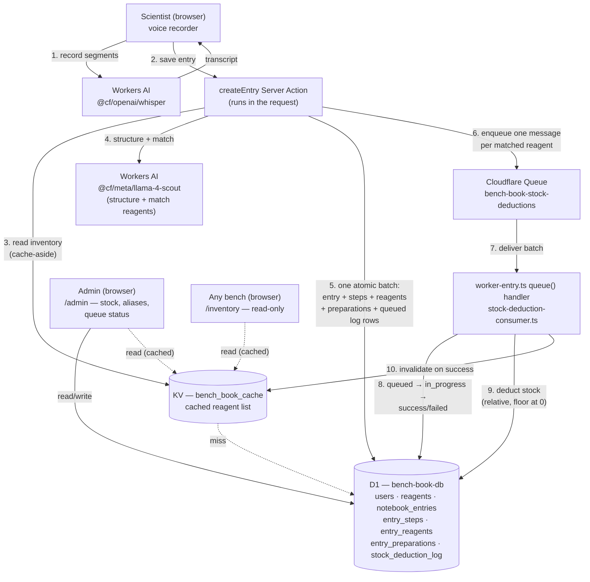

<!-- title: Bench Book -->

# Bench Book

A voice-dictated lab notebook with a shared reagent inventory. A scientist
dictates what they're doing at the bench; an LLM structures it into ordered
steps and a reagent list, matches each reagent against real inventory, and
usage is deducted from shared stock automatically — so every bench sees
accurate stock without anyone logging it by hand.

**Live**: https://eln-app.md-haque.workers.dev
**Demo login**: shown on the sign-in page (or register your own account).

## Features

- **Continuous voice dictation** — one click starts listening; audio is
  chunked on natural pauses and transcribed in the background as you keep
  talking, so no speech is lost.
- **AI structuring** — a raw transcript becomes an ordered list of steps and
  a reagent list (name, amount, concentration), extracted by an LLM prompted
  for completeness, not summary.
- **Reagent-to-inventory matching** — each dictated reagent is matched
  against real stock (including admin-curated aliases like "sodium
  chloride" → `NaCl`), never guessed by the model. An unmatched reagent is
  visibly flagged so an admin knows what to add.
- **Automatic stock deduction** — matched usage is deducted from shared
  inventory asynchronously via a Cloudflare Queue, with a full
  queued → in_progress → success/failed lifecycle visible on `/admin`.
- **Per-user privacy** — every scientist sees only their own entries, at
  both the list and direct-URL level.
- **Role-based access** — scientist vs. admin, enforced per page.
- **Hardened**: rate limiting, structured audit logging, Turnstile
  scaffolding, and a real (not simulated) secret-rotation drill — see
  [`docs/NOTES.md`](docs/NOTES.md).

## Architecture



Steps 2–6 are synchronous — the scientist's save doesn't return until the
entry is durably written. Steps 7–10 are not: stock deduction happens
*after* the response, on its own schedule, seconds later. That gap is
deliberate (the save must feel instant; inventory bookkeeping can trail by a
few seconds) and is also where the one known correctness limitation lives —
KV's own ~60s propagation delay, not a bug in this app's invalidation logic.
See [`docs/NOTES.md`](docs/NOTES.md) for the full writeup.

## Tech stack

| Layer | Choice |
|---|---|
| Framework | Next.js 16 (App Router) on Cloudflare Workers, via [OpenNext](https://opennext.js.org/cloudflare) |
| Auth | Auth.js v5, credentials + PBKDF2 (Web Crypto, no native bcrypt) |
| Database | Cloudflare D1 (SQLite) + Drizzle ORM |
| Cache | Cloudflare KV (cache-aside, reagent list) |
| Queue | Cloudflare Queues (stock deduction) |
| AI | Cloudflare Workers AI — Whisper (transcription), Llama 4 Scout (structuring) |
| Rate limiting | Cloudflare's `ratelimit` binding |
| Bot protection | Cloudflare Turnstile (scaffolded, inactive until configured) |

## Getting started

```bash
npm install
npm run preview   # builds for Cloudflare and runs it locally via wrangler
```

Two different local dev modes exist, depending on what you're touching:

```bash
npm run dev      # plain Next.js dev server — landing page only
npm run preview  # OpenNext build + wrangler dev — everything else
```

Anything that reads D1, calls Workers AI, or otherwise touches
`getCloudflareContext()` **throws under `npm run dev`** — that's every page
except the public landing page. Use `npm run preview` for real work.

`npm run preview`/`wrangler dev` require an active `wrangler login` session
— Workers AI bindings proxy to **real** Cloudflare inference even locally,
which incurs small real usage charges. There's no offline/mocked mode.

### Environment

Two separate files, because they feed two separate things — `.env.local`
feeds Next.js's `process.env`, while the app's actual runtime code reads
`getCloudflareContext().env`, which `wrangler dev` populates from
`wrangler.jsonc`'s `vars` and from `.dev.vars`. Both files are gitignored.

`.env.local` — Auth.js:

```
AUTH_SECRET=              # required — Auth.js session signing key
AUTH_TRUST_HOST=true      # required outside a known platform
AUTH_SECRET_PREVIOUS=     # optional — only set during a secret-rotation window
```

`.dev.vars` — local-only secrets for bindings `wrangler dev` reads directly:

```
TURNSTILE_SECRET_KEY=     # optional — omit to disable Turnstile verification locally
```

The Turnstile **sitekey** isn't secret, so it lives in `wrangler.jsonc`'s
committed `vars` instead of either env file, and is used as-is in both local
dev and production. In production, `TURNSTILE_SECRET_KEY` is set with
`wrangler secret put TURNSTILE_SECRET_KEY` (encrypted, never in a file).

### Local D1

Local D1 state lives in `.wrangler/state/v3/d1` — deleting `.wrangler/`
wipes it. Rebuild with every migration in order, then seed:

```bash
for f in drizzle/migrations/*.sql; do
  npx wrangler d1 execute bench-book-db --local --file="$f"
done
npx wrangler d1 execute bench-book-db --local --file=./drizzle/seed.sql
```

### Deploying

```bash
npm run deploy
```

Provisions/targets D1, KV, Workers AI, and the Cloudflare Queue declared in
`wrangler.jsonc`. `worker-entry.ts` is the actual Worker entry point (not
`.open-next/worker.js` directly) — it wraps OpenNext's generated `fetch`
handler to also add the queue consumer.

## Project structure

```
src/
  app/
    (app)/           # authenticated app shell — notebook, inventory, admin
      notebook/new/  # dictation + save
      notebook/[id]/ # entry detail
      admin/         # reagent stock, aliases, queue status
    api/
      transcribe/    # Whisper endpoint
      auth/          # Auth.js route handler
    login/, register/
  lib/
    structuring.ts   # LLM prompt, retry/truncation handling, reagent matching
    data/            # D1 data-access functions (entries, reagents, queue log)
    queue/           # stock-deduction message type + consumer
    auth/            # session guards, password hashing
    schemas/         # zod input validation
  db/schema.ts        # Drizzle schema
worker-entry.ts        # Worker entry point (fetch + queue handlers)
drizzle/migrations/     # SQL migrations, applied in order
```

## Further reading

[`docs/NOTES.md`](docs/NOTES.md) — the engineering retrospective: what
worked locally but needed a Cloudflare-specific fix, a Node-module
compatibility audit, the security-hardening pass (including a secret
rotation drill run for real against production), what surprised us and what
we'd do differently, a comparison against EdgeLedger's architecture, and a
set of "questions to ask yourself" about building on Workers.
