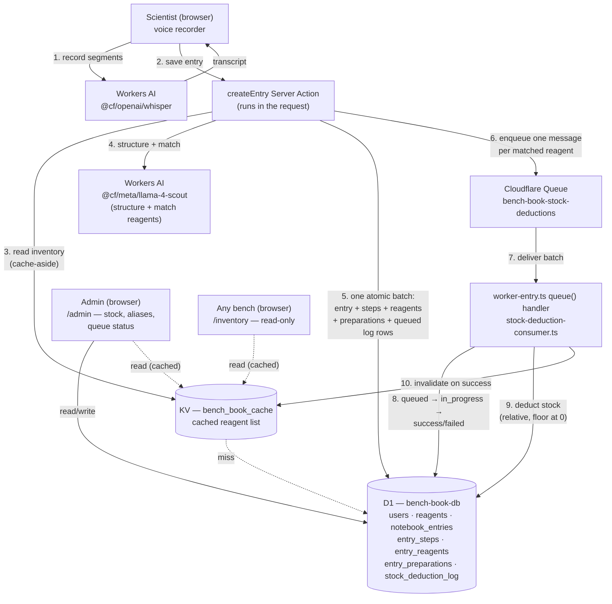

Bench Book — a voice-dictated lab notebook with a shared reagent inventory, deployed to Cloudflare Workers via Next.js + OpenNext.

## Architecture



The one thing this diagram can't show well: steps 2–6 are synchronous — the scientist's save doesn't return until the entry is durably written — but steps 7–10 are not. Stock deduction happens **after** the response, on its own schedule, seconds later. That gap is deliberate (see the notes below) and is also exactly where the one real outstanding correctness issue lives — KV's own propagation delay, not anything in this app's code.

## Getting started

Two different local dev modes, depending on what you're touching:

```bash
npm run dev      # plain Next.js dev server — landing page only
npm run preview  # OpenNext build + wrangler dev — everything else
```

Anything that reads D1 (Drizzle), calls Workers AI (Whisper transcription), or otherwise touches `getCloudflareContext()` **throws under `npm run dev`**. That's basically every page except the public landing page. Use `npm run preview` for real work.

Local D1 state lives in `.wrangler/state/v3/d1` — deleting `.wrangler/` (e.g. as part of a build-cache cleanup) wipes the local database. Recover with:

```bash
npx wrangler d1 execute bench-book-db --local --file=./drizzle/migrations/0000_harsh_wasp.sql
npx wrangler d1 execute bench-book-db --local --file=./drizzle/seed.sql
```

`wrangler dev`/`npm run preview` also require an active `wrangler login` session (or `CLOUDFLARE_API_TOKEN`/`CLOUDFLARE_ACCOUNT_ID` in `.env.local`) — Workers AI bindings proxy to **real** Cloudflare inference even in local dev, which incurs small real usage charges. There's no offline/mocked mode for this.

`.env.local` needs `AUTH_SECRET` and `AUTH_TRUST_HOST=true` — Auth.js refuses to trust the host by default outside of dev or a known platform, and this app doesn't run on one.

## What worked locally but needed a real fix for Cloudflare

- **Edge middleware (`proxy.ts`) + Auth.js — removed entirely.** Under OpenNext's Cloudflare adapter, the proxy/middleware execution context perceived every request as HTTPS and looked for a `__Secure-`-prefixed session cookie. The real cookie — set by the main request handler, which correctly saw plain HTTP in local dev — had no such prefix. The proxy silently rejected valid, freshly-issued sessions every time, confirmed by inspecting the mismatched `Set-Cookie` headers on the wrongly-redirected response. This is exactly the class of problem the OpenNext build output warns about ("Node.js middleware support is experimental in Cloudflare... use at your own risk"). **Fix**: page-level guards (`requireSession`/`requireAdmin` in `src/lib/auth/authz.ts`) call `auth()` directly inside each protected Server Component — the same execution context that issued the cookie — so they don't hit the mismatch. There is deliberately no `proxy.ts` in this app; every protected page gates itself.
- **`MediaRecorder`'s built-in `timeslice` chunking doesn't produce independently-decodable audio.** Only the *first* chunk has valid container headers; the rest are headerless continuation data that Whisper (or any decoder) can't read alone. **Fix**: stop the current `MediaRecorder` and immediately start a fresh one on the same live `MediaStream` for each segment — every segment is then a complete, independently valid file, and starting the next one before the previous segment's transcription is even sent means no audio is lost while a request is in flight.
- **Whisper's actual input schema doesn't match what a web search suggests.** Search results pointed at `audio: base64string`, which is the schema for a *different* model (`@cf/openai/whisper-large-v3-turbo`). The model we're actually bound to, `@cf/openai/whisper`, wants `{ audio: number[] }` — the raw bytes as a plain array. Confirmed from Cloudflare's own generated runtime types (`npm run cf-typegen`), not from search. **Lesson**: for Workers AI model schemas, trust `wrangler types` over search results.

## Module compatibility audit

Three modules from typical Node projects that don't run on Workers, and what replaces each:

**bcrypt.** It ships a native (N-API) binding compiled for the Node.js runtime — Workers run on V8 isolates with no native addon loading, no filesystem to load a `.node` binary from, and no libuv. There's no way to `require()` a compiled C++ module at the edge. **Replacement**: the Web Crypto API (`crypto.subtle`), which is a first-class, standardized global on Workers (and in browsers, and in modern Node). This app already does exactly this in `src/lib/auth/password.ts` — PBKDF2 via `crypto.subtle.deriveBits`, salted and stored as `salt:hash`, with a constant-time comparison on verify. It was written this way from the start specifically so auth would work unmodified once deployed here.

**Anything that imports Node's `fs`.** Workers have no local filesystem — no disk to read from or write to, since a Worker isn't a persistent machine, it's a request-scoped isolate that can be evicted at any time. Code that does `fs.readFile`/`fs.writeFile` (config loaders, local caches, image processing libraries that shell out to a temp file) fails immediately since `fs` doesn't exist in the runtime. **Replacement**: object storage. Files that need to persist go in R2 (Cloudflare's S3-compatible bucket storage, reachable via a binding, not a filesystem path); anything that's really just static build output belongs in the `ASSETS` binding OpenNext already wires up for us.

**A long-lived TCP database driver** (raw `pg`, `mysql2`, or an `ioredis`-style client that opens a persistent socket via Node's `net` module). Workers don't support raw TCP sockets at all — the only outbound primitive is `fetch`, and a Worker instance isn't guaranteed to live long enough to hold a connection pool open between requests anyway. A driver built around "open a socket once, reuse it across many queries" has no way to open that socket in the first place. **Replacement**: a database that speaks HTTP instead of a wire protocol over TCP. This app uses D1 (SQLite over the `D1Database` binding, no socket involved) via Drizzle's `drizzle-orm/d1` driver; for Postgres specifically, the equivalent move is something like `@neondatabase/serverless` (HTTP/WebSocket-based) instead of `pg`.

## Protecting the app

- **Structured `[AUDIT]` logging** (`src/lib/audit.ts`) — one JSON line per mutation (notebook entry creation, reagent stock updates/creation, registration, login attempts), actor/action/target/outcome. Verified live: `wrangler tail` while exercising the app produces genuinely parseable JSON, e.g. `[AUDIT] {"timestamp":"...","actor":"scientist@benchbook.app","action":"user.login","outcome":"success"}` — confirmed by piping it straight into `json.loads`, not just eyeballing it.
- **Rate limiting** on `/register` (3/60s), login (5/60s), and `/api/transcribe` (10/60s, keyed by user id since it costs real money per call regardless of who's asking) — via `wrangler.jsonc`'s `unsafe.bindings` (the `ratelimit` binding type is still under the `unsafe` key even though it's a stable, documented feature). **Real finding, not a bug**: the configured limit is approximate, not exact — testing the register limiter (configured for 3/60s) let 4 requests through before the 5th was rejected. Cloudflare's own docs describe the `simple` algorithm as approximate rather than a precise sliding window. Lesson: treat the configured number as a rough ceiling, not a hard guarantee, and pick limits with that slop in mind.
- **Turnstile scaffolding** is built (`src/lib/turnstile.ts`, `src/components/turnstile-widget.tsx`, wired into `/register`) but **inert until you create a widget**: `TURNSTILE_SECRET_KEY`/`TURNSTILE_SITEKEY` are empty placeholders, and `verifyTurnstile()` treats an empty secret as "not configured" and skips the check entirely — the exact same graceful-degradation shape as the Whisper/Llama fallbacks elsewhere in this app. To activate: create a widget in the Cloudflare dashboard, put the sitekey in `wrangler.jsonc`'s `vars` (it's public, safe to commit) and the secret via `wrangler secret put TURNSTILE_SECRET_KEY`.
- **AI Gateway**: not yet wired in — creating one needs either the Cloudflare dashboard or a token with AI Gateway permissions (the token in `.env.local` doesn't have that scope; confirmed via a real `401` from the API, not assumed).

### The secret-rotation drill (actually run against production, not simulated)

`AUTH_SECRET` is what Auth.js uses to sign and decrypt every session JWT. `src/auth.ts` reads it as **two Cloudflare secret names**, not one — `AUTH_SECRET` (current) and `AUTH_SECRET_PREVIOUS` (only set during a rotation window) — and tries each in order, same shape as any Cloudflare service-to-service shared-secret rotation (two named secrets, code checks both), just applied to session decryption instead of a header comparison.

Ran the full drill for real, with live session cookies as evidence at each step:

1. **Wrong way**: captured a valid session (C1), then rotated `AUTH_SECRET` directly to a new value with `wrangler secret put` — no dual-key window. C1 immediately went from a valid session to `null`. No warning, no grace period — every logged-in user is silently signed out the instant the secret changes, and this took effect on the *very next request*, no redeploy needed.
2. **Right way**: captured a new session under the now-current secret (C2), then set `AUTH_SECRET_PREVIOUS` to that same value and rotated `AUTH_SECRET` to a third, fresh value. C2 (signed with the "previous" secret) kept working, and a brand new login (C3) got signed with the new one — the dual-key window genuinely holds both live at once.
3. **Retire**: deleted `AUTH_SECRET_PREVIOUS`. C2 didn't die immediately — it took about 20 seconds to actually become invalid. **Real finding**: secret *creation/update* via `wrangler secret put` is visible on the next request, but secret *deletion* has a real propagation delay across Cloudflare's edge network. Don't assume a `wrangler secret delete` has taken effect everywhere the instant the command returns.

## Notes to review — what surprised us, what we got wrong, what we'd do differently

Everything above this point was written earlier in the build. This section covers what happened after: turning the LLM's plain-text extraction into something that reliably matches a real inventory and deducts real stock through a real Cloudflare Queue.

**A simplified prompt silently dropped guarantees we'd already earned.** After tuning the structuring prompt for completeness and anti-hallucination ("extract EVERY step," "use ONLY what was said"), a later request to make the prompt "as simple as possible" removed those lines along with the verbosity — because they read as verbosity, not as guarantees. Nothing failed loudly; the model just quietly got a little less complete. Lesson: when trimming an LLM prompt, every remaining line should earn its place on its own, not by how it reads next to what's being cut.

**Two different reagent-matching bugs, in opposite directions — both silent.** First: an "unambiguous prefix match" (so "Tris buffer" would find "Tris buffer, pH 7.4") silently matched a *different* pH (7.5) to the stocked 7.4 item — attributing usage to the wrong reagent and hiding that the real one wasn't stocked. Second, after fixing that: letting the LLM propose which inventory item a mention referred to, then only checking that the proposed name *existed* — the model mapped "protein stock" to "Pfizer" (a real but unrelated inventory row), and the code accepted it because "Pfizer" was a real name. A synonym ("sodium chloride" → "NaCl") and a hallucination ("protein stock" → "Pfizer") share zero tokens; no string heuristic can tell them apart. Fix: aliases are now admin-curated data (a column an admin fills in), never model-inferred — the model's guess is logged as a disagreement signal, never trusted directly.

**We told ourselves something false, and initially believed it.** After the alias fix, a report to this project claimed "0 disagreements" logged during testing — based on `grep`-ing a terminal log file that came up empty. It turned out this version of `wrangler dev` routes `console.*` output through a queryable local API, not to the stdout being captured. The real query showed disagreements *had* occurred. The lesson isn't "the feature was broken" — it's that an empty log is not evidence of anything until you've confirmed the log itself is actually being captured.

**A hardcoded token budget, and a retry that couldn't have helped.** `max_tokens: 1536` truncated the LLM's response on a large dictation (40 reagents), and the retry used the *same* cap — so it failed identically twice and fell back to a much cruder regex parser, silently. Fixed by reading the model's own `finish_reason` to detect truncation specifically, and only escalating the token budget on a retry that was actually truncated (a malformed-but-complete response needs a different fix — asking the model to correct its own output, not more room).

**Wrapping OpenNext's generated Worker to add a queue consumer wasn't obvious.** OpenNext's `.open-next/worker.js` only exports a `fetch` handler — there's no supported hook for a `queue()` handler. The fix (a small `worker-entry.ts` that re-exports OpenNext's `fetch` and adds `queue` alongside it) is simple once you see it, but surfaced its own build-ordering bug: `next build`'s own TypeScript pass tried to check that wrapper file, which imports `.open-next/worker.js` — a file that doesn't exist until a *later* build step. Had to exclude the wrapper from Next's tsconfig.

**A near-miss double-deduction bug, caught by testing the failure path on purpose.** The first version of the queue consumer wrote its "success" log row inside the same `try` block as the stock update. If that *log write* failed right after a successful deduction, the surrounding `catch` would have called `message.retry()` — deducting the same amount a second time. The deduction succeeding is not the same thing as the task being fully done; only code that treats those as separate concerns catches this. Fixed by giving the log write its own `catch` that can never escalate into a retry of an already-applied deduction.

**Migration tooling needed a manual workaround.** Renaming `stock_deduction_log.outcome` to `status` (with new values) required `drizzle-kit generate` to ask a rename-vs-add question interactively — and this environment has no TTY to answer it. Since the table was verified empty in both databases, the migration SQL and its snapshot metadata were written by hand, then checked by running `generate` again and confirming it reported no further changes.

**KV's eventual consistency, discovered by watching real behavior instead of trusting the code.** The queue consumer correctly calls `env.bench_book_cache.delete(...)` immediately after a successful deduction. Stock still showed stale on `/inventory` for up to a minute afterward. Cloudflare KV writes (including deletes) can take up to 60 seconds to propagate to every edge location — a node serving the next page load can still be holding the old cached value until propagation catches up. The invalidation call being correct doesn't make KV's own consistency model disappear. This is the one open item from this build: for data an admin needs to trust *immediately* after an action, cache-aside KV in front of D1 may be the wrong tool at this app's scale, where a direct D1 read would just be cheap and always correct.

**What we'd do differently.** Design the `stock_deduction_log` task lifecycle (queued → in_progress → success/failed) from the start, instead of shipping a fire-and-forget deduction first and retrofitting visibility after being asked for it — the retrofit needed a schema migration that a first design wouldn't have. Treat "the LLM extracts data" and "the code decides what to trust from it" as two separate, non-negotiable layers from day one, instead of learning that boundary from two separate silent-failure incidents. And default to no cache for low-traffic, correctness-sensitive admin data, adding one only after seeing real load — not assuming cache-aside is free just because the pattern is familiar.

## Comparing notes with EdgeLedger

EdgeLedger (`reference/`) solves several of the same problems this app does — queues, D1, rate limiting, Turnstile, Web-Crypto password hashing, structured audit logging — but arrived at different, and in places more thorough, answers.

**One Worker vs. five.** Bench Book is a single Worker: one OpenNext-built Next.js app, wrapped by `worker-entry.ts` to also handle the queue consumer, all in one deploy. EdgeLedger splits the same shape of problem into five separate Workers connected by service bindings — a frontend, a Durable-Object write coordinator, a standalone AI worker, a queue consumer worker, and a Workflows worker. Ours is simpler to reason about and deploy; theirs lets each piece scale, redeploy, and fail independently — the AI worker in particular is reusable across *both* of EdgeLedger's frontends (Next.js and TanStack Start) because it's its own service, where Bench Book's LLM call is inline in the data layer and only usable from this one app.

**No dead-letter queue — a deliberate gap we should probably close.** EdgeLedger's consumer worker is configured with `dead_letter_queue: "edgeledger-events-dlq"`. Bench Book's queue consumer has `max_retries: 3` and nothing beyond that — a deduction that fails on every retry is marked `"failed"` in `stock_deduction_log` and then the message is simply gone. The admin view shows *that* it failed, but there's no durable holding queue to inspect or replay it from. EdgeLedger's approach is the more complete one here.

**No idempotency key — a real correctness gap this comparison surfaced.** EdgeLedger's Durable Object write path accepts an `idempotencyKey`, caches the result in DO storage, and cleans it up later via `alarm()` — so a retried request, whatever caused the retry, provably can't double-apply. Bench Book's queue consumer has no equivalent: our near-miss double-deduction bug (above) was caught by careful code structure (isolating the log write's failure mode), not by an idempotency check that would catch *every* possible double-delivery, including one caused by the Worker being killed between the D1 update and `message.ack()`. That's a real gap EdgeLedger's pattern would close and ours doesn't.

**Durable Objects and Workflows: not used here at all.** EdgeLedger uses a Durable Object as its single write coordinator (serializing writes, holding the idempotency cache) and Cloudflare Workflows for its durable, multi-step monthly-statement pipeline. Bench Book has no Durable Object and no Workflow — `createEntry`'s D1 batch plays the DO's "make this one write atomic" role, and the Queue plays the Workflow's "let this survive past the request" role, but neither gets the stronger guarantees (serialized access, automatic step-retry with persisted state) those primitives provide. For this app's scale — one shared inventory, not per-user financial ledgers — that trade looks reasonable; it wouldn't at EdgeLedger's scale.

**Auth: session-based role check vs. SSO.** Bench Book's admin gate is `requireAdmin()` reading a role out of an Auth.js session this app issues itself. EdgeLedger puts `/admin/*` behind Cloudflare Access (SSO, email-policy-gated) and verifies the resulting JWT in the Worker with `jose` — a materially stronger trust model, since the identity provider is external and the Worker never has to trust its own login form for admin access specifically.

## Questions to ask yourself

**When would you use a Worker instead of a Node.js server?** When the workload is request/response shaped, latency-sensitive, and benefits from running physically close to the user — exactly this app's shape (many benches, one shared reagent count, want every read/write to feel instant regardless of which bench is asking). You would *not* reach for a Worker for something that needs a long-lived process: a persistent WebSocket server juggling in-memory state across requests, a background job that runs for minutes, or anything that assumes a stable filesystem or a kept-open database connection between requests. Durable Objects exist for the "need statefulness across requests, at the edge" case; a plain Worker doesn't give you that by default.

**Why doesn't bcrypt run on Workers, and what replaces it?** Covered above — no native addon loading on V8 isolates; Web Crypto's PBKDF2 replaces it, as already implemented in `password.ts`.

**What is `ctx.waitUntil` for, and what breaks if you forget it?** A Worker's `fetch` handler is allowed to keep doing work *after* the response has been sent back to the client, but only if that work is registered via `ctx.waitUntil(promise)` — it tells the runtime "don't tear down this isolate/request context until this promise settles too." Forget it, and any fire-and-forget async work you kicked off (writing an analytics event, invalidating a cache tag, an audit log write) can simply get cut off mid-flight the moment the response finishes, with no error and no guarantee it ever completes. We haven't called `ctx.waitUntil` directly ourselves — OpenNext's own request handling appears to use it internally for things like populating Next.js's incremental/tag cache in the background (visible in the preview server's own log lines, "Incremental cache does not need populating" / "Tag cache does not need populating") — but every actual write in this app (`db.batch(...)`, `env.AI.run(...)`) is `await`-ed directly in the request path before responding, specifically so we never depend on background work surviving past the response.

**Secrets vs vars in `wrangler.jsonc`: which goes where, and why?** `vars` in `wrangler.jsonc` are plaintext, checked into the repo, visible to anyone who can read the file — fine for things that aren't sensitive (`AUTH_TRUST_HOST`, a public Turnstile sitekey). `AUTH_SECRET` is not that: it's the key Auth.js uses to encrypt and sign every session token, and anyone who has it can forge a valid session for any user. It's set with `wrangler secret put AUTH_SECRET` in production — encrypted server-side, never in a committed file — while `.env.local` (gitignored) holds a separate value for local dev, which doesn't need to match production at all since they're entirely different session stores. We've since rotated the production value twice for real (see the drill below), which only reinforced the point: a secret is exactly the kind of value where "how do I change this without breaking everyone's session" actually matters in practice, not just in theory.

**Where does "cold start ≈ 0" actually break down?** "Cold start ≈ 0" is a claim about the *Worker's own JS runtime* spinning up — a V8 isolate starting is genuinely near-instant compared to booting a container or a Node process, since isolates don't need their own OS process or memory space. It says nothing about the *work the Worker then does*. In this app: a Workers AI call (Whisper transcription, or Llama-based structuring) is a real inference request to Cloudflare's AI infrastructure — seconds, not milliseconds, regardless of how fast the Worker itself woke up. A D1 query is a real network round trip to SQLite running elsewhere at the edge, not an in-process memory read. The isolate wakes up instantly; what it then has to wait on doesn't.

**What breaks if you rotate a secret in the wrong order?** Demonstrated for real above: overwrite `AUTH_SECRET` directly with no transition, and every existing session becomes invalid on the very next request — no error surfaced to the user beyond a silent logout, no warning, no grace period. The fix isn't exotic — it's just refusing to have exactly one valid value at any moment or during any window.

**Could you trace every change to a record from logs alone?** Yes, for the mutations that matter here — `wrangler tail | grep AUDIT` returns one parseable JSON line per notebook entry creation, reagent stock change, registration, and login attempt, with actor/action/target/outcome on every line. It would not (yet) catch a raw D1 edit made outside the app, or anything from before audit logging was added — the log is only as complete as the code path that emits it.
